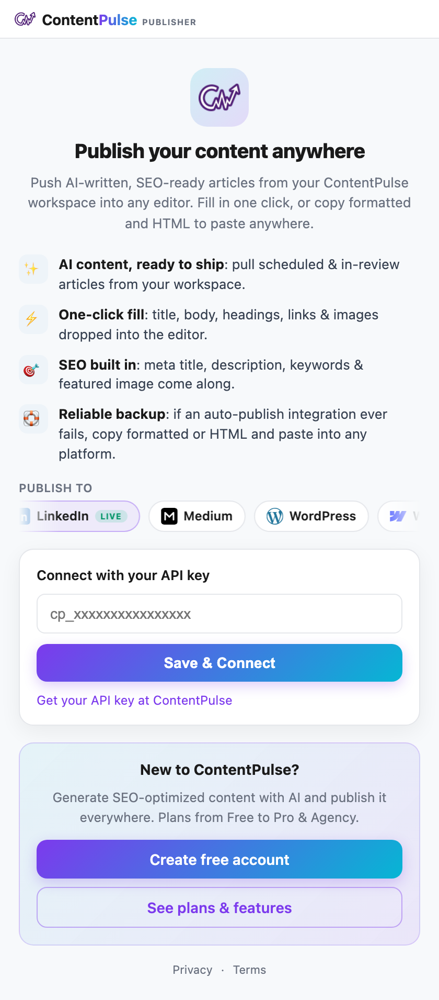
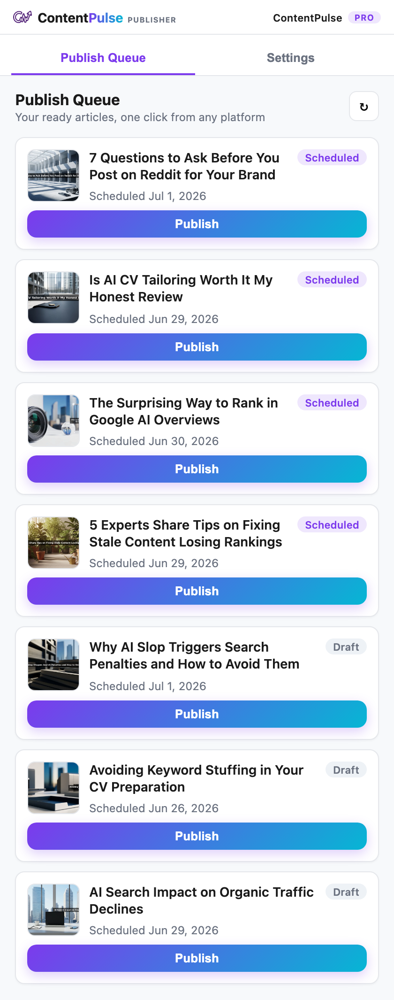
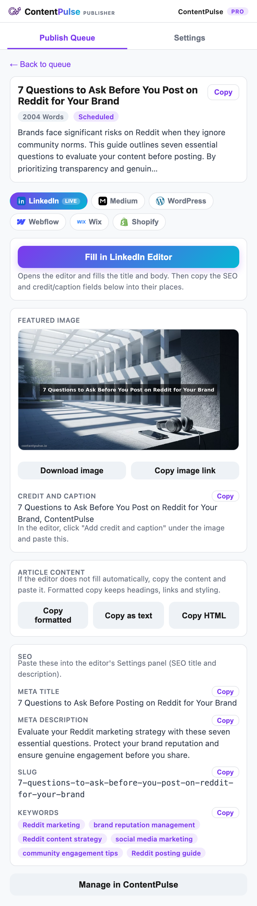
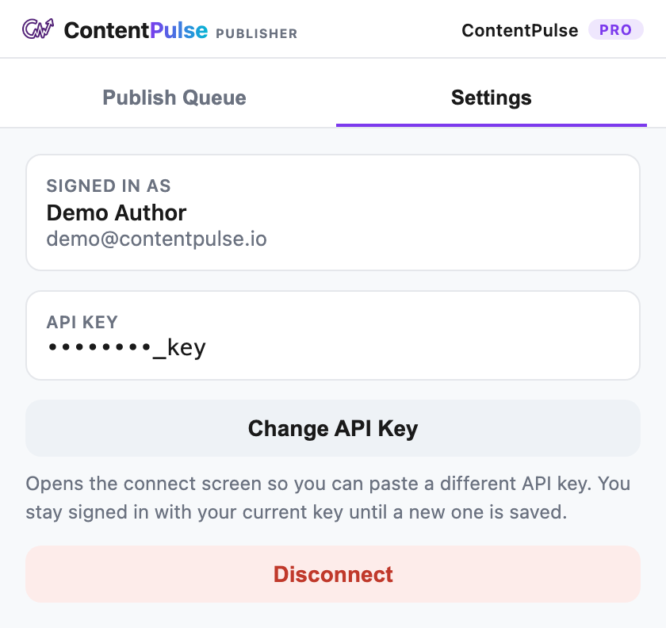

# ContentPulse Publisher

A Chrome (Manifest V3) browser extension that pushes AI‑written, SEO‑ready
articles from your [ContentPulse](https://contentpulse.io) workspace straight
into a publishing editor. Fill the LinkedIn Article editor in one click, or copy
the formatted / HTML version to paste anywhere.



## Features

- **AI content, ready to ship** — pull scheduled & in‑review articles from your workspace.
- **One‑click fill** — title, body, headings, links & images dropped into the editor.
- **SEO built in** — meta title, description, keywords & featured image come along.
- **Reliable backup** — if an auto‑publish integration ever fails, copy formatted or HTML and paste into any platform.

## Install (unpacked / development)

1. Clone or download this repository.
2. Open `chrome://extensions` in Chrome (or any Chromium browser).
3. Enable **Developer mode** (top‑right toggle).
4. Click **Load unpacked** and select this folder (the one containing `manifest.json`).
5. Pin the **ContentPulse Publisher** icon to your toolbar.

## Usage

### 1. Connect your workspace

Open the extension popup and sign in to connect your ContentPulse workspace. Your
workspace name and plan tier appear in the header once connected.

### 2. Pick an article from the Publish Queue

The **Publish Queue** lists your scheduled and in‑review articles. Select one to
review its details before publishing.



### 3. Review and publish

The detail view shows the title, body, SEO metadata, and featured image. From
here you can:

- **Fill in editor** — open the target editor (e.g. a LinkedIn Article) and the
  extension fills the title and formatted body automatically.
- **Copy formatted** / **Copy HTML** — paste into any other platform as a fallback.



### 4. Settings

Manage your connection and publishing preferences from the **Settings** tab.



## How "Fill in editor" works

The extension targets the LinkedIn Article editor
(`https://www.linkedin.com/article/*` and `/pulse/*`). A content script
(`content.js`) detects the editor fields and asks the background service worker
(`background.js`) to fill the title and paste the formatted body. LinkedIn's
rich‑text editor (ProseMirror) re‑renders shortly after mounting, so the body is
pasted with a short grace delay and re‑asserted until it persists — this keeps
the formatted content from being wiped by the editor's first re‑render.

## Permissions

| Permission | Why it is needed |
|---|---|
| `storage` | Save your session and publishing preferences locally. |
| `tabs` | Open / target the editor tab to fill it. |
| `scripting` | Inject the fill routine into the editor page. |
| `host_permissions` for `contentpulse.io` and `linkedin.com` | Fetch your articles and fill the LinkedIn editor. |

## Project layout

```
manifest.json     Extension manifest (MV3)
background.js     Service worker — performs the page fill
content.js        Content script injected into the LinkedIn editor
popup.html        Popup UI (onboarding, queue, detail, settings)
popup.js          Popup logic
styles.css        Popup styles
assets/           Icons and logos
docs/             Screenshots used in this README
```

## License

Proprietary — © ContentPulse. All rights reserved.
